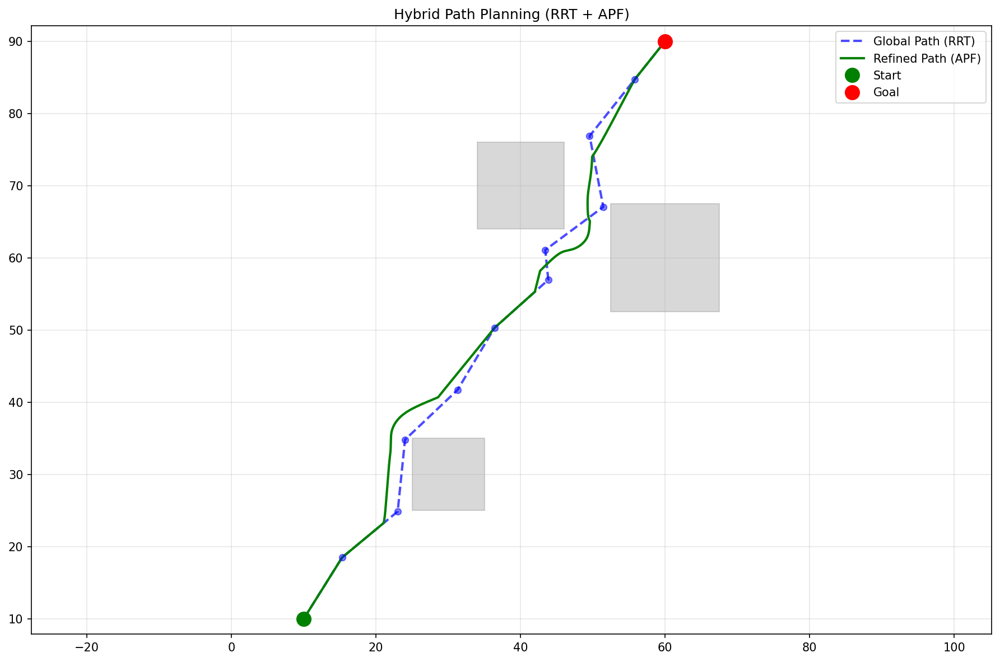
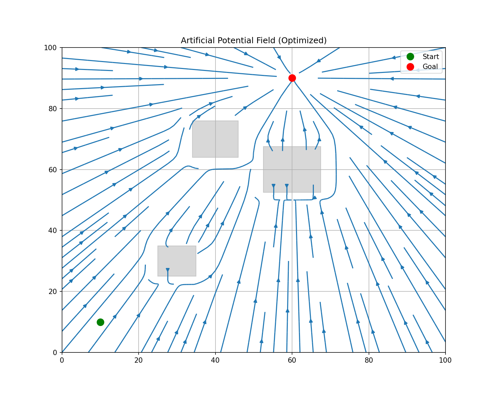
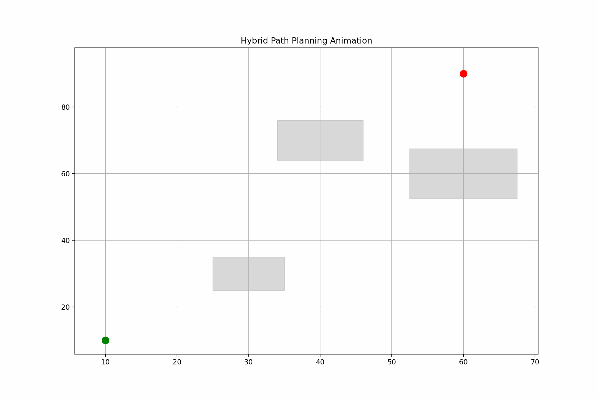

# Hybrid Path Planning (RRT + APF)

Repository for a hybrid path planning project that combines **Rapidly-exploring Random Trees (RRT)** for global exploration with **Artificial Potential Fields (APF)** for local path refinement.  
This approach leverages the strengths of both planners to generate efficient and smooth trajectories for autonomous navigation.

<details>
<summary>🚀 How to run my project? </summary>

**Prerequisites:**  

```bash
pip install numpy matplotlib shapely
```

**Run the project:**  

```bash
python main.py
```

This will:
- Generate a global path using RRT
- Refine it with APF
- Visualize the process and save:
  - The environment with obstacles
  - The RRT initial path
  - The smoothed APF path
  - A GIF animation of the planning process
  - The potential field heatmap

</details>

<details>
<summary>
###Implementation Details</summary>


### Global Planning (RRT)
- Rapidly explores the configuration space
- Generates an initial feasible path
- Handles complex environments efficiently

### Local Planning (APF)
- Refines the global path for smoothness
- Uses attractive forces towards the goal
- Implements repulsive forces from obstacles
- Provides dynamic obstacle avoidance

### Visualization
- Real-time path planning visualization
- Animated demonstration of the planning process
- Clear representation of obstacles and paths

## Configurable Parameters

| Parameter | Meaning |
|----------|---------|
| `k_att` | Attractive force gain |
| `k_rep` | Repulsive force gain |
| `rho_0` | Obstacle influence range |
| `local_step_size` | Step size for local planner |
| `max_iterations` | Maximum iterations for RRT |

</details>
## Visualization & Outputs
The planner generates multiple visual artifacts for analysis.

### What do I get? 

- **Global path:** Blue dashed line  
- **Refined path:** Green solid line  
- **GIF animation:** Step-by-step planning process  
- **Potential field heatmap:** Shows force vectors and gradients  

<div align="center">



<p><em>First hybrid planning example </em></p>
</div>

<details>
<summary> some gif ✨</summary>

<div align="center">



</div>
</details>
